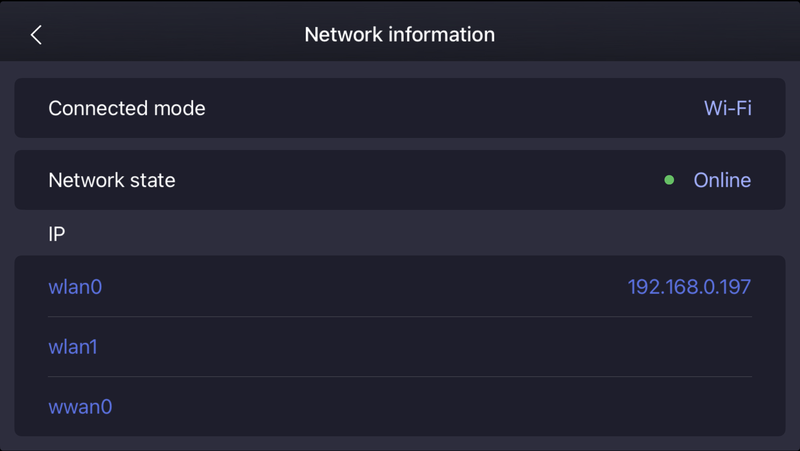

# Troubleshooting

If you have problems getting the communication working, try this checklist.

1. Scan for the Go2 in your local network

```
% go2-scanner
==================================================
Unitree Go2 Robot Discovery
==================================================
Discovering devices on the network...
Discovered device: B42D2000XXXXXXX at 192.168.0.197
```

If this does not work, check the Unitree phone app under
Device->Data->Network information:



If you directly connect to the Go2 with an Etherne cable,
the IP address is `192.168.123.161`.


2. Ping your robot 

See if you can access it over your network:
```
% ping 192.168.0.197
PING 192.168.0.197 (192.168.0.197): 56 data bytes
64 bytes from 192.168.0.197: icmp_seq=0 ttl=64 time=9.875 ms
64 bytes from 192.168.0.197: icmp_seq=1 ttl=64 time=7.469 ms
```

3. Check if you the service is available

This makes sure, that the IP you want to connect to runs the WebRTC service:
```
% curl 192.168.0.197:9991/con_notify
eyJkYXRhMSI6Ikl3V1k5dWl2MEdNSUlCSURBTkJna3Foa2lHOXcwQkFRRUZBQUtDQVFF
...
Mi91TzZtc0NNTWNvdXFpMy9ucG1NR1daaE0yUUlCRVE9PUlITEFHSFJGS0QifQ==
```

4. Try getting lowstate data

```
% python examples/data_channel/lowstate/lowstate.py --once
Go2 Robot Low State Monitoring
Press Ctrl+C to stop
==============================
🔌 Initializing robot connection...
🔗 Connecting to robot...
🕒 WebRTC connection        : 🟡 started       (16:27:45)
Decoder set to: LibVoxelDecoder
🕒 Signaling State          : 🟡 have-local-offer (16:27:45)
🕒 ICE Gathering State      : 🟡 gathering     (16:27:45)
🕒 ICE Gathering State      : 🟢 complete      (16:27:45)
🕒 ICE Connection State     : 🔵 checking      (16:27:45)
🕒 Peer Connection State    : 🔵 connecting    (16:27:45)
🕒 Signaling State          : 🟢 stable        (16:27:45)
🕒 ICE Connection State     : 🟢 completed     (16:27:45)
🕒 Peer Connection State    : 🟢 connected     (16:27:45)
🕒 Data Channel Verification: ✅ OK            (16:27:45)
✅ Connected to robot successfully!
📋 Current motion mode: mcf
📡 Starting low state monitoring...
✅ Monitoring low state data (Ctrl+C to stop)
================================================================================
📊 COMPREHENSIVE ROBOT LOW STATE DATA
================================================================================

🧭 IMU STATE DATA:
----------------------------------------
   Roll/Pitch/Yaw:    [-1.558, -0.380, -6.491] deg

⚙️  MOTOR STATES (12 motors):
------------------------------------------------------------
Motor       Pos(rad)    Vel(r/s)    Torque(Nm)    Temp(°C)
--------  ----------  ----------  ------------  ----------
FR_hip       -0.0333           0             0          31
FR_thigh      0.7173           0             0          31
FR_calf      -1.4104           0             0          34
FL_hip        0.0031           0             0          31
FL_thigh      0.7285           0             0          31
FL_calf      -1.5055           0             0          32
RR_hip       -0.0104           0             0          40
RR_thigh      0.7636           0             0          32
RR_calf      -1.4381           0             0          33
RL_hip        0.1255           0             0          41
RL_thigh      0.6848           0             0          31
RL_calf      -1.411            0             0          33

🦶 FOOT FORCE SENSORS:
----------------------------------------
Foot           Force(N)  Status
-----------  ----------  ---------
Front Right          94  ✅ Contact
Front Left           90  ✅ Contact
Rear Right           89  ✅ Contact
Rear Left            86  ✅ Contact

🔋 BATTERY MANAGEMENT SYSTEM:
----------------------------------------
   State of Charge: 49.0 %
   Other BMS data:
     version_high: 1
     version_low: 18
     current: -2087
     cycle: 11
     bq_ntc: [29, 28]
     mcu_ntc: [32, 30]

🔍 ADDITIONAL DATA:
----------------------------------------
   temperature_ntc1: 42
   power_v: 28.596647
Go2 connection mode: STA-L
🕒 Signaling State          : ⚫ closed        (16:16:45)
🕒 ICE Connection State     : ⚫ closed        (16:16:45)
🕒 Peer Connection State    : ⚫ closed        (16:16:45)
🕒 WebRTC connection        : 🔴 disconnected  (16:16:45)
✅ WebRTC connection closed successfully
Done.
```

5. Try an action

Ask the do go sit.

```
% python examples/data_channel/sit_down.py
🔌 Initializing robot connection...
🔗 Connecting to robot...
🕒 WebRTC connection        : 🟡 started       (16:40:47)
Decoder set to: LibVoxelDecoder
🕒 Signaling State          : 🟡 have-local-offer (16:40:47)
🕒 ICE Gathering State      : 🟡 gathering     (16:40:47)
🕒 ICE Gathering State      : 🟢 complete      (16:40:47)
🕒 ICE Connection State     : 🔵 checking      (16:40:47)
🕒 Peer Connection State    : 🔵 connecting    (16:40:47)
🕒 Signaling State          : 🟢 stable        (16:40:47)
🕒 ICE Connection State     : 🟢 completed     (16:40:47)
🕒 Peer Connection State    : 🟢 connected     (16:40:48)
INFO:root:Validation succeed
🕒 Data Channel Verification: ✅ OK            (16:40:48)
✅ Connected to robot successfully!
📊 Setting up state monitoring...
✅ State monitoring enabled
🤖 State #1: Mode=0, Progress=0, Gait=0, Height=0.312m, Roll=0.020, Pitch=-0.027, Yaw=-1.296
INFO:root:Network status message received.
Go2 connection mode: STA-L
📋 Current motion mode: mcf
🪑 Starting sit down demonstration...
🎯 Executing command: Sit
🤖 State #43: Mode=0, Progress=0, Gait=0, Height=0.313m, Roll=0.029, Pitch=-0.045, Yaw=-1.300
🤖 State #44: Mode=0, Progress=0, Gait=0, Height=0.317m, Roll=0.037, Pitch=-0.076, Yaw=-1.303
🤖 State #45: Mode=0, Progress=0, Gait=0, Height=0.323m, Roll=0.045, Pitch=-0.139, Yaw=-1.311
🤖 State #46: Mode=0, Progress=0, Gait=0, Height=0.330m, Roll=0.059, Pitch=-0.223, Yaw=-1.321
🤖 State #47: Mode=0, Progress=0, Gait=0, Height=0.333m, Roll=0.094, Pitch=-0.296, Yaw=-1.339
🤖 State #48: Mode=0, Progress=0, Gait=0, Height=0.333m, Roll=0.079, Pitch=-0.366, Yaw=-1.358
🤖 State #49: Mode=0, Progress=0, Gait=0, Height=0.329m, Roll=0.093, Pitch=-0.440, Yaw=-1.373
🤖 State #50: Mode=0, Progress=0, Gait=0, Height=0.317m, Roll=0.066, Pitch=-0.506, Yaw=-1.365
🤖 State #51: Mode=0, Progress=0, Gait=0, Height=0.307m, Roll=0.030, Pitch=-0.584, Yaw=-1.346
🤖 State #52: Mode=0, Progress=0, Gait=0, Height=0.288m, Roll=0.001, Pitch=-0.649, Yaw=-1.325
🤖 State #53: Mode=0, Progress=0, Gait=0, Height=0.267m, Roll=0.009, Pitch=-0.722, Yaw=-1.321
🤖 State #54: Mode=0, Progress=0, Gait=0, Height=0.249m, Roll=0.006, Pitch=-0.802, Yaw=-1.334
🤖 State #55: Mode=0, Progress=0, Gait=0, Height=0.234m, Roll=0.002, Pitch=-0.851, Yaw=-1.358
🤖 State #56: Mode=0, Progress=0, Gait=0, Height=0.229m, Roll=-0.005, Pitch=-0.873, Yaw=-1.371
🤖 State #57: Mode=0, Progress=0, Gait=0, Height=0.227m, Roll=-0.022, Pitch=-0.871, Yaw=-1.365
🤖 State #59: Mode=0, Progress=0, Gait=0, Height=0.228m, Roll=-0.024, Pitch=-0.854, Yaw=-1.368
🤖 State #61: Mode=0, Progress=0, Gait=0, Height=0.230m, Roll=-0.018, Pitch=-0.849, Yaw=-1.378
🤖 State #63: Mode=0, Progress=0, Gait=0, Height=0.235m, Roll=-0.009, Pitch=-0.848, Yaw=-1.396
🤖 State #65: Mode=0, Progress=0, Gait=0, Height=0.238m, Roll=-0.001, Pitch=-0.849, Yaw=-1.410
🤖 State #68: Mode=0, Progress=0, Gait=0, Height=0.241m, Roll=0.011, Pitch=-0.850, Yaw=-1.420
🤖 State #140: Mode=0, Progress=0, Gait=0, Height=0.243m, Roll=0.013, Pitch=-0.860, Yaw=-1.419
✅ Command Sit executed successfully
🎯 Executing command: StandUp
🤖 State #258: Mode=0, Progress=0, Gait=0, Height=0.248m, Roll=0.010, Pitch=-0.836, Yaw=-1.413
🤖 State #259: Mode=0, Progress=0, Gait=0, Height=0.256m, Roll=0.009, Pitch=-0.781, Yaw=-1.412
🤖 State #260: Mode=0, Progress=0, Gait=0, Height=0.267m, Roll=0.015, Pitch=-0.729, Yaw=-1.413
🤖 State #261: Mode=0, Progress=0, Gait=0, Height=0.279m, Roll=0.022, Pitch=-0.674, Yaw=-1.414
🤖 State #262: Mode=0, Progress=0, Gait=0, Height=0.290m, Roll=0.030, Pitch=-0.613, Yaw=-1.416
🤖 State #263: Mode=0, Progress=0, Gait=0, Height=0.299m, Roll=0.036, Pitch=-0.552, Yaw=-1.417
🤖 State #264: Mode=0, Progress=0, Gait=0, Height=0.306m, Roll=0.040, Pitch=-0.485, Yaw=-1.419
🤖 State #265: Mode=0, Progress=0, Gait=0, Height=0.310m, Roll=0.041, Pitch=-0.419, Yaw=-1.419
🤖 State #266: Mode=0, Progress=0, Gait=0, Height=0.315m, Roll=0.040, Pitch=-0.351, Yaw=-1.419
🤖 State #267: Mode=0, Progress=0, Gait=0, Height=0.317m, Roll=0.039, Pitch=-0.281, Yaw=-1.419
🤖 State #268: Mode=0, Progress=0, Gait=0, Height=0.318m, Roll=0.037, Pitch=-0.208, Yaw=-1.415
🤖 State #269: Mode=0, Progress=0, Gait=0, Height=0.318m, Roll=0.034, Pitch=-0.132, Yaw=-1.407
🤖 State #270: Mode=0, Progress=0, Gait=0, Height=0.317m, Roll=0.027, Pitch=-0.062, Yaw=-1.396
🤖 State #271: Mode=0, Progress=0, Gait=0, Height=0.315m, Roll=0.021, Pitch=-0.029, Yaw=-1.383
🤖 State #273: Mode=0, Progress=0, Gait=0, Height=0.314m, Roll=0.016, Pitch=-0.030, Yaw=-1.372
🤖 State #276: Mode=0, Progress=0, Gait=0, Height=0.315m, Roll=0.017, Pitch=-0.041, Yaw=-1.378
🤖 State #320: Mode=0, Progress=0, Gait=0, Height=0.314m, Roll=0.016, Pitch=-0.031, Yaw=-1.379
✅ Command StandUp executed successfully
🕒 Signaling State          : ⚫ closed        (16:41:04)
🕒 ICE Connection State     : ⚫ closed        (16:41:04)
🕒 Peer Connection State    : ⚫ closed        (16:41:04)
🕒 WebRTC connection        : 🔴 disconnected  (16:41:04)
✅ WebRTC connection closed successfully
````

6. Try to receive Lidar data

```
% python lidar_stream.py
🕒 WebRTC connection        : 🟡 started       (16:44:58)
Decoder set to: LibVoxelDecoder
🕒 Signaling State          : 🟡 have-local-offer (16:44:58)
🕒 ICE Gathering State      : 🟡 gathering     (16:44:58)
🕒 ICE Gathering State      : 🟢 complete      (16:44:58)
🕒 ICE Connection State     : 🔵 checking      (16:44:58)
🕒 Peer Connection State    : 🔵 connecting    (16:44:58)
🕒 Signaling State          : 🟢 stable        (16:44:58)
🕒 ICE Connection State     : 🟢 completed     (16:44:58)
🕒 Peer Connection State    : 🟢 connected     (16:44:58)
INFO:root:Validation succeed
🕒 Data Channel Verification: ✅ OK            (16:44:58)
Traffic saving: disabled
Decoder set to: LibVoxelDecoder
{'stamp': 1754923000.0, 'frame_id': 'odom', 'resolution': 0.05, 'src_size': 77824, 'origin': [-3.225, -3.975, -0.575], 'width': [128, 128, 38], 'data': {'point_count': 9833, 'face_count': 17499, 'positions': array([ 32,  77,   9, ..., 105,  56,  38], dtype=uint8), 'uvs': array([ 48,   0,  48, ...,   0, 180, 255], dtype=uint8), 'indices': array([    0,     1,     2, ..., 69994, 69993, 69995], dtype=uint32)}}
{'stamp': 1754923000.0, 'frame_id': 'odom', 'resolution': 0.05, 'src_size': 77824, 'origin': [-3.225, -3.975, -0.575], 'width': [128, 128, 38], 'data': {'point_count': 9853, 'face_count': 17513, 'positions': array([ 32,  77,   9, ..., 105,  56,  38], dtype=uint8), 'uvs': array([ 48,   0,  48, ...,   0, 180, 255], dtype=uint8), 'indices': array([    0,     1,     2, ..., 70050, 70049, 70051], dtype=uint32)}}
{'stamp': 1754923000.0, 'frame_id': 'odom', 'resolution': 0.05, 'src_size': 77824, 'origin': [-3.225, -3.975, -0.575], 'width': [128, 128, 38], 'data': {'point_count': 9867, 'face_count': 17515, 'positions': array([ 32,  77,   9, ..., 105,  56,  38], dtype=uint8), 'uvs': array([ 48,   0,  48, ...,   0, 180, 255], dtype=uint8), 'indices': array([    0,     1,     2, ..., 70058, 70057, 70059], dtype=uint32)}}
{'stamp': 1754923000.0, 'frame_id': 'odom', 'resolution': 0.05, 'src_size': 77824, 'origin': [-3.225, -3.975, -0.575], 'width': [128, 128, 38], 'data': {'point_count': 9842, 'face_count': 17497, 'positions': array([ 32,  77,   9, ..., 105,  56,  38], dtype=uint8), 'uvs': array([ 48,   0,  48, ...,   0, 180, 255], dtype=uint8), 'indices': array([    0,     1,     2, ..., 69986, 69985, 69987], dtype=uint32)}}
{'stamp': 1754923000.0, 'frame_id': 'odom', 'resolution': 0.05, 'src_size': 77824, 'origin': [-3.225, -3.975, -0.575], 'width': [128, 128, 38], 'data': {'point_count': 9870, 'face_count': 17513, 'positions': array([ 32,  77,   9, ..., 105,  56,  38], dtype=uint8), 'uvs': array([ 48,   0,  48, ...,   0, 180, 255], dtype=uint8), 'indices': array([    0,     1,     2, ..., 70050, 70049, 70051], dtype=uint32)}}
{'stamp': 1754923000.0, 'frame_id': 'odom', 'resolution': 0.05, 'src_size': 77824, 'origin': [-3.225, -3.975, -0.575], 'width': [128, 128, 38], 'data': {'point_count': 9870, 'face_count': 17523, 'positions': array([ 32,  77,   9, ..., 105,  56,  38], dtype=uint8), 'uvs': array([ 48,   0,  48, ...,   0, 180, 255], dtype=uint8), 'indices': array([    0,     1,     2, ..., 70090, 70089, 70091], dtype=uint32)}}
````
